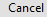

# About

## Getting started with Gitbook

It has a wysiwyg editor.

```python
def hello_world():
    pass

```


&#x20;The above is python code


Suppose it must support images too:



## Testing

Automatically generates a table of contentss
